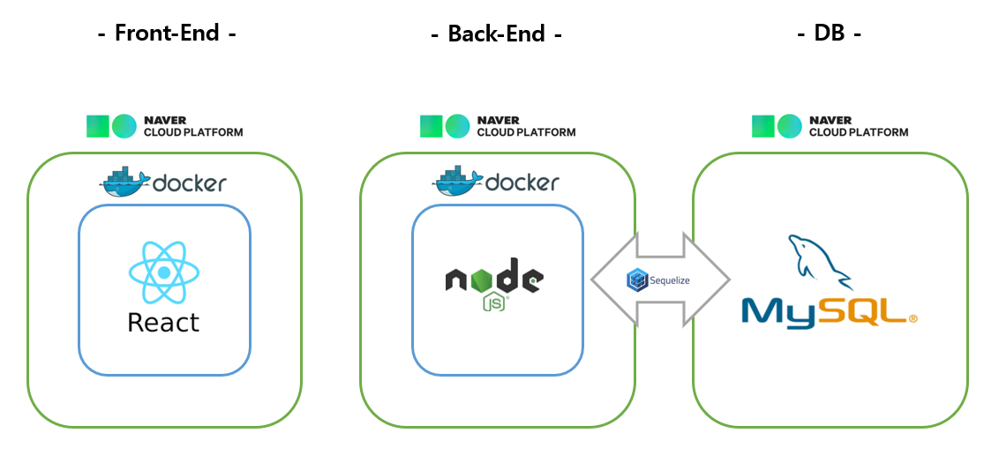
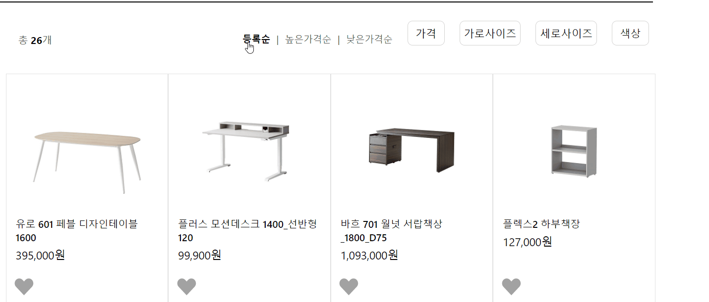
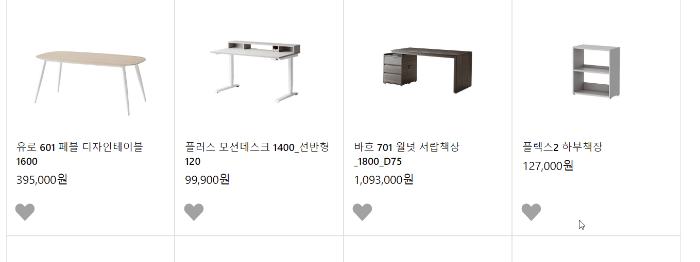

# Welcome to hanssem 👋

> 한샘닷컴에 '필터 기능'을 추가한 프로젝트 입니다.

자취생은 한정된 방 때문에 인테리어에 제한을 받습니다.

자취생의 입장에서 한샘닷컴에 추가되었으면 하는 '필터 기능'을 구현했습니다.


### ✨ [구현 페이지 링크](http://sonjina.site/)


## 아키텍쳐


## 개발환경
- Javascript
- React
- styled-coponent
- Express
- Sequelize
- Docker
- Mysql
- Git
- Eslint


## 페이지


## 필터 형식
슬라이드, 또는 선택형으로 구현했습니다.


## 필터 적용 데모



### 필터 기준 1) 가구의 크기

자취방은 공간이 좁아, 가구가 방에 들어가는지를 기준으로 선택합니다.
 따라서 가로, 세로의 크기로 필터를 설정했습니다.

### 필터 기준 2) 색상
인테리어에서는 방의 분위기가 중요하기 때문에 색상을 기준으로 필터를 구현했습니다.

### 필터 기준 3) 가격
비용이 적을수록, 또는 클수록 좋은 제품이 아니라 자신의 상황에 따라 선택의 폭이 달라지기에 이를 대입해 범위를 설정할 수 있도록 하였습니다.

### 추가 기능) 정렬

기존에 있던 '낮은 가격순', '높은 가격순', '등록순'을 구현했습니다.

### 추가 기능) 하트
재미로 하트 누르는 기능을 구현했습니다. 따로 DB에 저장되지 않습니다.



## Usage

```sh
cd front-end
npm install
npm start

cd ../back-end
npm install
npm start
```

## Author

👤 **jina**


***
_This README was generated with ❤️ by [readme-md-generator](https://github.com/kefranabg/readme-md-generator)_
